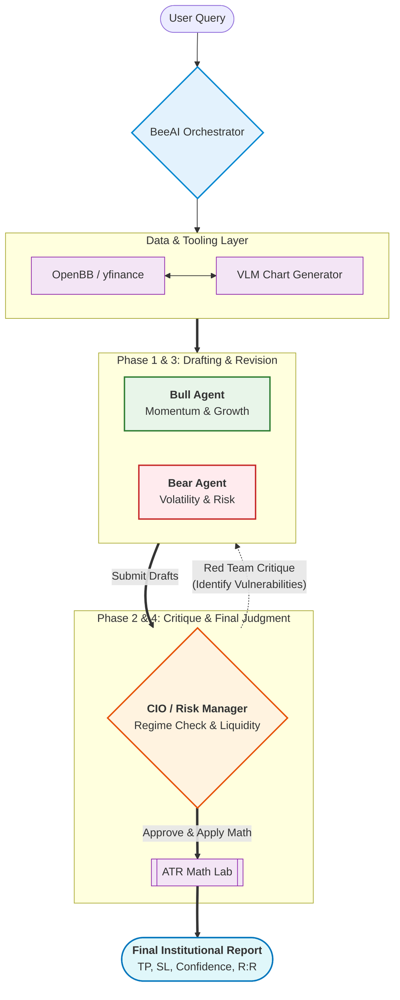

# 📈 AI Stock Analysis Chatbot (V1.0)

[](https://huggingface.co/spaces/aarya-pabha/AI-Stock-Analysis-Chatbot)
[](https://opensource.org/licenses/MIT)
[](https://www.python.org/downloads/release/python-3110/)

**Institutional-grade multi-agent stock analysis with FINSABER backtesting.** Powered by Gemini 3.1, BeeAI, and OpenBB, this engine simulates a professional trading floor where AI analysts debate and refine their thesis through a cyclic reflection loop before issuing mathematically-backed signals.

---

## ✨ Highlights
- 🧠 **Agentic Reflection Loop**: A multi-step workflow where Bull and Bear analysts are critiqued and revised by a CIO.
- 📉 **Bi-Directional Signal Engine**: Supports Long/Short equity signals with automated ATR risk management.
- 🧪 **FINSABER Backtesting**: Verifies signals against next-day open prices with point-in-time fundamental data gating.
- 👁️ **Multimodal Intelligence**: Analysts "see" charts via integrated Vision-Language Models (GPT-4o).
- 🤖 **Agent-Ready Architecture**: Built for AI coding agents with structured `GEMINI.md` protocols.

---

## 🏗️ Architecture: The Council Flow
The system utilizes a stateful **BeeAI Workflow** to orchestrate specialized agents, each with dedicated Python toolsets.



---

## 🛠️ Quick Start

### 1. Prerequisites
- Python 3.11+
- OpenAI API Key (for GPT-4o Orchestration)
- OpenBB Personal Access Token (PAT)

### 2. Installation
```bash
git clone https://github.com/aarya-pabha/-AI-Stock-Analysis-Chatbot.git
cd -AI-Stock-Analysis-Chatbot
python -m venv venv
.\venv\Scripts\activate  # Unix: source venv/bin/activate
pip install -r requirements.txt
```

### 3. Launch Institutional Dashboard
```bash
python main.py
```

---

## 📊 Technical Standards
- **Reflective Loop**: Steps are strictly state-managed: `Drafting` -> `Critique` -> `Revision` -> `Judgment`.
- **Math Lab**: Generates exact ATR-based Stop-Loss (SL) and Take-Profit (TP) levels.
- **Execution Reality**: Backtests simulate execution at the **Next-Day Market Open** to prevent data leakage.

---

## 🤖 AI Agent Integration
This repository is optimized for **AI-Assisted Development**. 
- **Instructions**: See [GEMINI.md](./GEMINI.md) for tool schemas and architectural constraints.
- **Project Context**: AI coding agents can use `MEMORY.md` to track implementation history.

---

## 🤝 Contributing
Contributions are welcome! See our `PRD.md` for technical specifications and the Stage 6 Roadmap (Live Brokerage Integration).

---
*Disclaimer: This tool is for educational and research purposes only. Trading stocks involves significant risk.*
