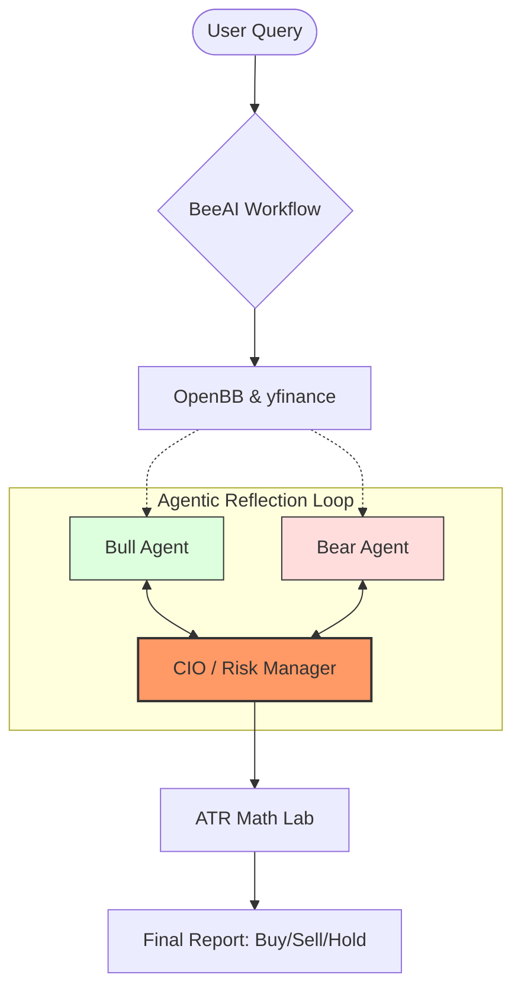

# 📈 AI Stock Analysis Chatbot (V1.0)

[](https://huggingface.co/spaces/aarya-pabha/AI-Stock-Analysis-Chatbot)
[](https://opensource.org/licenses/MIT)
[](https://www.python.org/downloads/release/python-3110/)

**An institutional-grade, multi-agent stock analysis engine.** Powered by Gemini 3.1, BeeAI, and OpenBB, this system simulates a professional trading floor to provide high-conviction, mathematically-backed trade signals.

---

## ✨ Key Features
- 🧠 **Multi-Agent Council (FINSABER)**: A debate-driven workflow between Bull, Bear, and CIO agents to eliminate bias.
- 📉 **Bi-Directional Signal Engine**: Supports both **Long and Short** positions with inverted risk management.
- 🧪 **Walk-Forward Backtesting**: Point-in-time simulation using next-day market open prices to ensure zero data leakage.
- 👁️ **Multimodal Analysis**: Integrated Vision-Language Models (VLMs) that "see" technical charts like a human analyst.
- 🤖 **Agent-Ready Architecture**: Built-in support for Gemini CLI and other AI coding agents via `GEMINI.md`.

---

## 🏗️ Architecture: The Council Flow
The system employs a **Reflective Loop** where agents critique and revise their thesis before a final quantitative decision is made by the CIO.



---

## 📊 Technical Standards
- **Risk Management**: Automated ATR-based Stop-Loss (SL) and Take-Profit (TP) calculation.
- **Data Integrity**: Gated fundamentals to prevent "survivorship bias" during backtests.
- **Execution Strategy**: Simulated next-day open execution for realistic slippage modeling.

---

## 🛠️ Quick Start

### 1. Prerequisites
- Python 3.11+
- OpenAI API Key (for GPT-4o Orchestration)
- OpenBB Personal Access Token (PAT)

### 2. Installation
```bash
git clone https://github.com/aarya-pabha/-AI-Stock-Analysis-Chatbot.git
cd -AI-Stock-Analysis-Chatbot
python -m venv venv
source venv/bin/activate  # Windows: .\venv\Scripts\activate
pip install -r requirements.txt
```

### 3. Launch Dashboard
```bash
python main.py
```

---

## 🤖 AI Agent Integration
This repository is optimized for **AI-Assisted Development**. 
- **Instructions**: See [GEMINI.md](./GEMINI.md) for architecture rules and build commands.
- **Memory**: Private context is maintained in the `.gemini/` directory (ignored by git).

---

## 🤝 Contributing
Contributions are welcome! Please see our `PRD.md` for the technical specification and future roadmap items (e.g., Stage 6: Live Brokerage Integration).

---
*Disclaimer: This tool is for educational and research purposes only. Trading stocks involves significant risk.*
